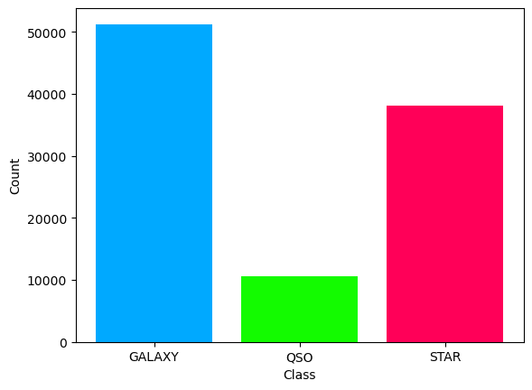
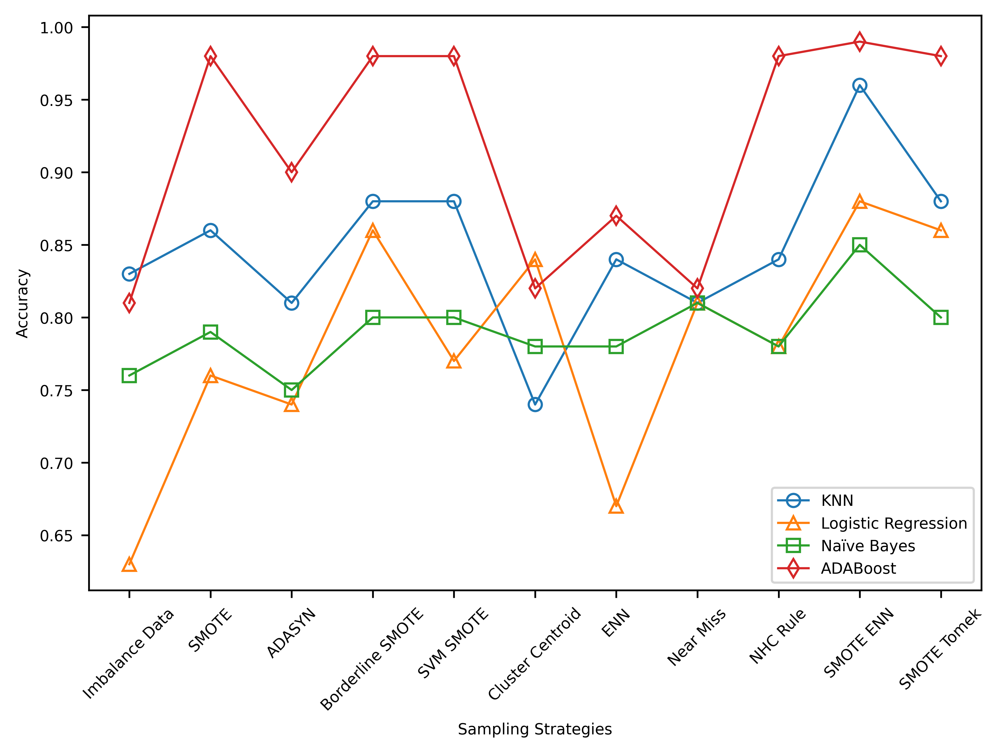
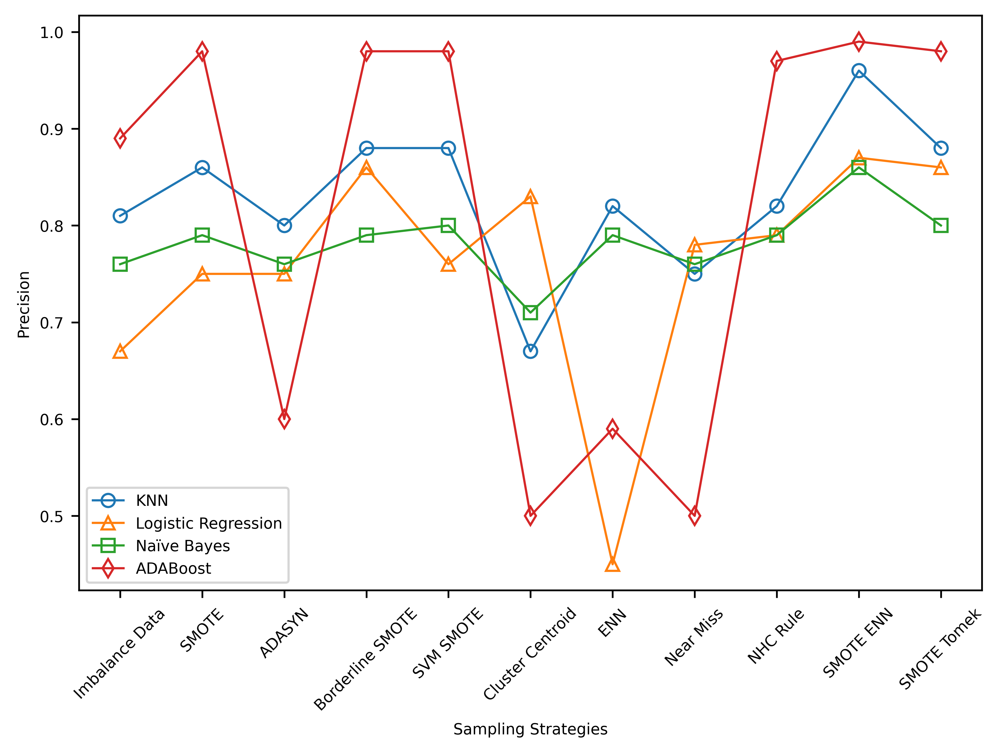
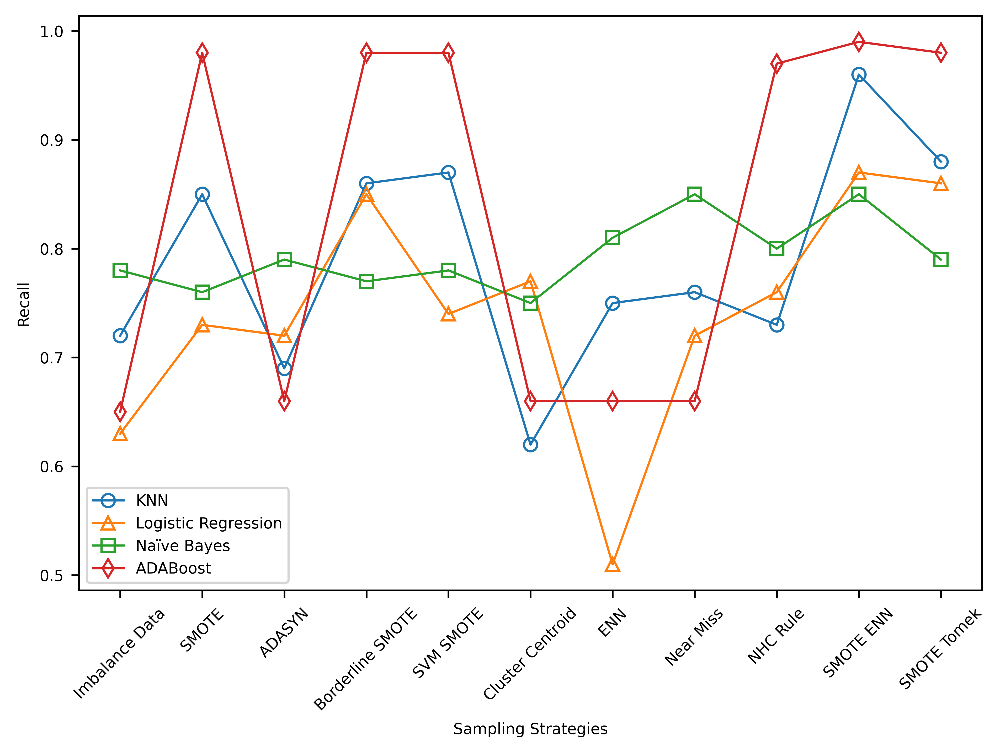
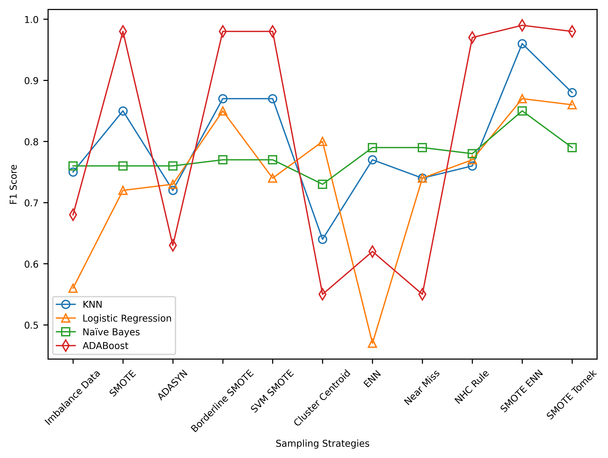

# AN-APPROACH-TO-CLASSIFY-ASTRONOMICAL-OBJECT-USING-IMBALANCED-SLOAN-DIGITAL-SKY-SURVEY-DATA

Classifying astronomical objects, including stars, galaxies, and quasars, is a complex task due to data complexity and class imbalance. This project leverages the Sloan Digital Sky Survey Data Release 16 (SDSS DR16) dataset and applies various resampling techniques to balance the dataset. By evaluating different classifiers such as K-Nearest Neighbour, Logistic Regression, Naive Bayes, and AdaBoost on both balanced and imbalanced datasets, the study finds that AdaBoost outperforms others. This suggests that well-tuned classifiers, combined with appropriate resampling, can significantly enhance the classification accuracy of astronomical objects. The results demonstrate the importance of overcoming class imbalance for accurate astronomical object classification, with potential implications for our understanding of the Universe.

Addressing training bias due to dataset imbalance, we used various resampling techniques. The figure below illustrates our approach, starting with oversampling methods like SMOTE, Borderline SMOTE-1, SVM SMOTE, and ADASYN. We then applied undersampling techniques, including ENN, NearMiss, NHCRule, and Cluster Centroid. Hybrid methods, SMOTEENN and SMOTETomek, were also employed.

Utilizing the publicly available SDSS DR16 dataset, we addressed class imbalance. Preprocessing steps involved data cleaning, anomaly removal, feature selection, PCA for dimensionality reduction, and normalization. The dataset was then split into training, validation, and test sets for model performance evaluation. The figure below represent the class distribution of the dataset.

This study investigates the classification of astronomical objects using the SDSS D16 dataset and the impact of resampling techniques. Results reveal that AdaBoost outperforms with the highest precision, recall, and F1 score. Resampling techniques effectively address class imbalance, with SMOTEENN being the most effective. The findings underscore the importance of considering multiple performance metrics in evaluating classifiers, with a focus on resampling techniques to enhance classification accuracy in imbalanced datasets.

This research aimed to assess the impact of resampling techniques on the classification of astronomical objects using SDSS D16 data. Results show that SMOTE-ENN was the most effective resampling method, significantly improving classification performance. These findings emphasize the importance of addressing class imbalance in astronomical object classification and offer insights into the effectiveness of different resampling methods. However, future research should explore the potential of other classifiers, resampling techniques, and additional features to enhance classification accuracy.
