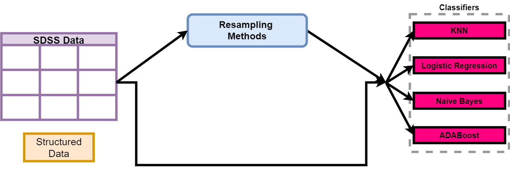

# AN-APPROACH-TO-CLASSIFY-ASTRONOMICAL-OBJECT-USING-IMBALANCED-SLOAN-DIGITAL-SKY-SURVEY-DATA

Classifying astronomical objects, including stars, galaxies, and quasars, is a complex task due to data complexity and class imbalance. This project leverages the Sloan Digital Sky Survey Data Release 16 (SDSS DR16) dataset and applies various resampling techniques to balance the dataset. By evaluating different classifiers such as K-Nearest Neighbour, Logistic Regression, Naive Bayes, and AdaBoost on both balanced and imbalanced datasets, the study finds that AdaBoost outperforms others. This suggests that well-tuned classifiers, combined with appropriate resampling, can significantly enhance the classification accuracy of astronomical objects. The results demonstrate the importance of overcoming class imbalance for accurate astronomical object classification, with potential implications for our understanding of the Universe.

Addressing training bias due to dataset imbalance, we used various resampling techniques. The figure below illustrates our approach, starting with oversampling methods like SMOTE, Borderline SMOTE-1, SVM SMOTE, and ADASYN. We then applied undersampling techniques, including ENN, NearMiss, NHCRule, and Cluster Centroid. Hybrid methods, SMOTEENN and SMOTETomek, were also employed.

